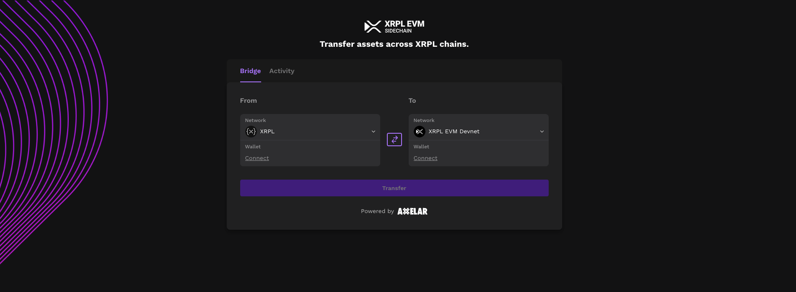
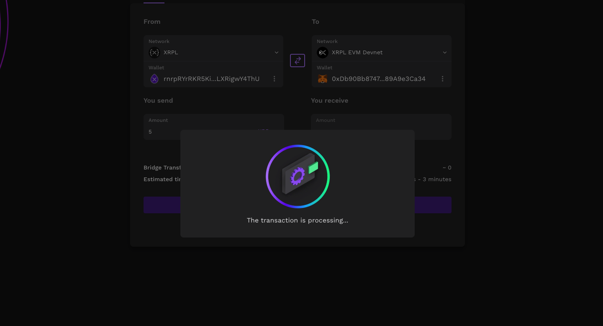

# Axelar Interchain Transfer from XRPL

## Using Portal

You can bridge native XRP from XRPL to XRPL EVM sidechain using Axelar Portal. In this example, we will transfer 5 XRP to an account in the XRPL EVM Sidechain.

First, set XRPL as the source chain and XRPL EVM sidechain as the destination chain.

Then, select the faucet account on the XRPL chain.

Then, connect your wallet using Metamask for the XRPL EVM Sidechain.

Once your wallet is connected, you can start choosing the token you want to transfer and set the desired amount (currently, only XRP is supported). Click on `Transfer` and confirm the transaction in your wallet.

Then, await the transaction to be executed.

Once the transaction is executed, you can see the transaction details in the following modal.

To confirm the transfer, you can go to the XRPL EVM Sidechain explorer and search for the transaction hash.

