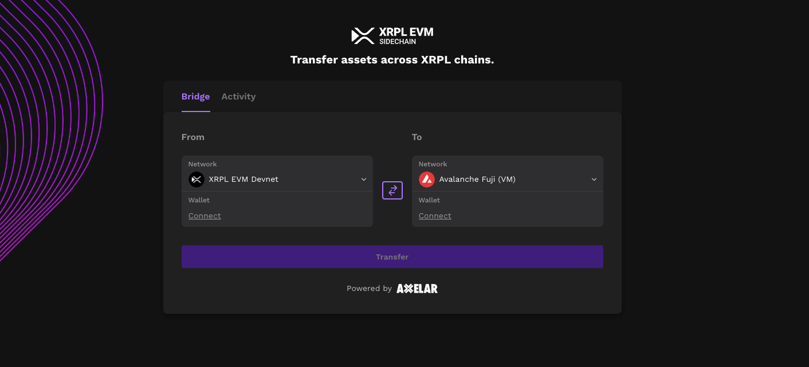
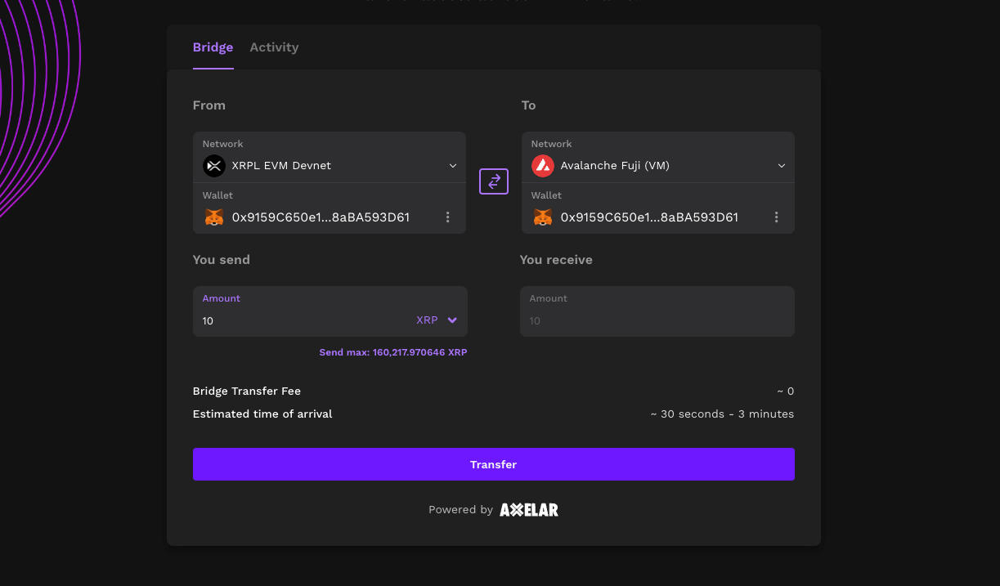
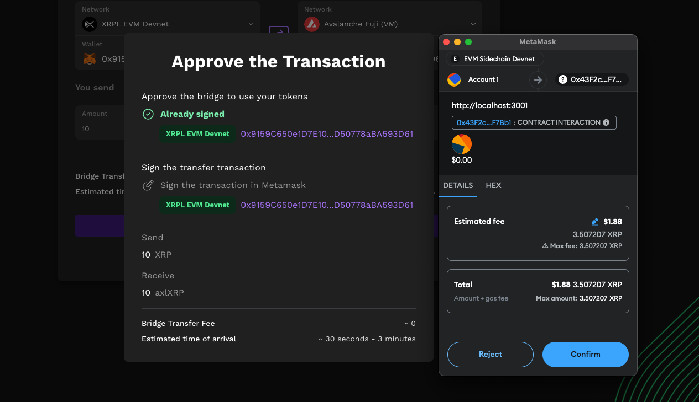
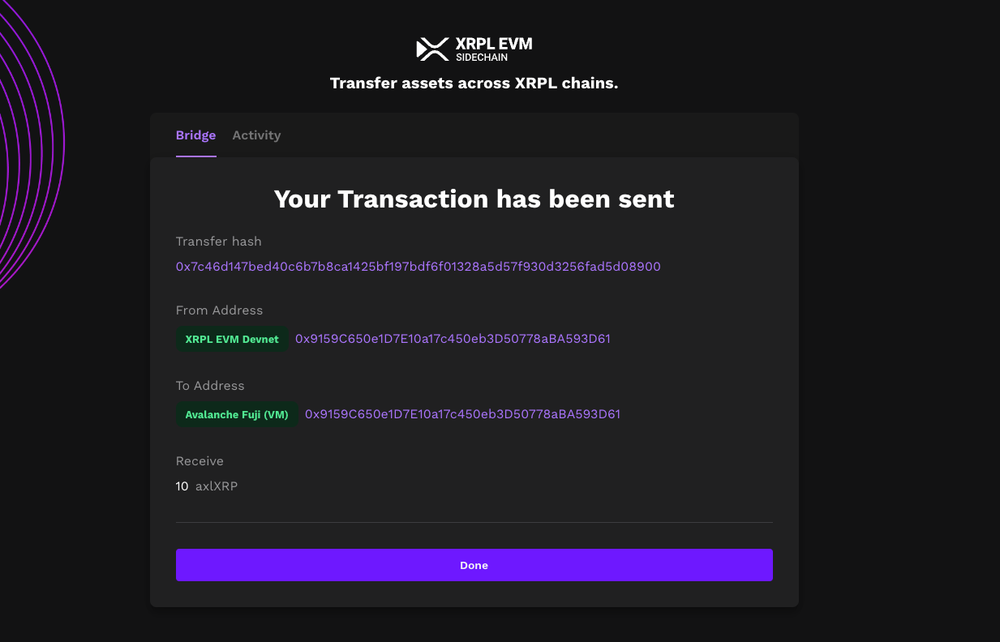

# Axelar Interchain Transfer to Avalanche Fuji

You can transfer tokens from XRPL EVM sidechain to Avalanche Fuji using Axelar Portal. In this example, we will transfer 10 XRP to Avalanche Fuji as axlXRP.

1. Set XRPL EVM sidechain as the source chain and Avalanche Fuji as the destination chain.

2. Connect your wallet using Metamask for both chains.

3. Choose the token you want to transfer and set the desired amount.

4. Click on `Transfer` and confirm the transaction in your wallet.

Once the transaction is executed, you can see the transaction details in the following modal.

To confirm the transfer, you can go to the Avalanche Fuji explorer and search for the transaction hash.

