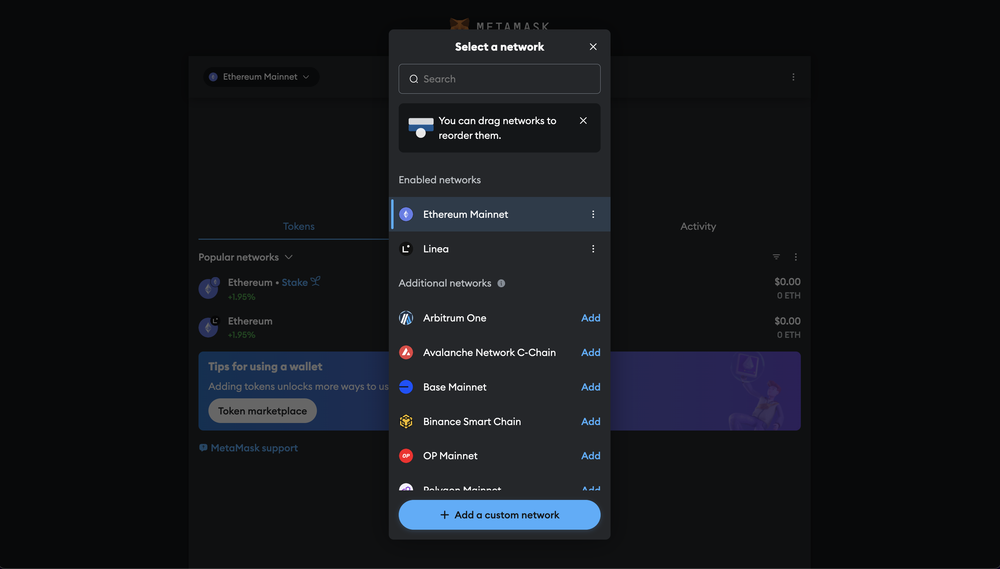
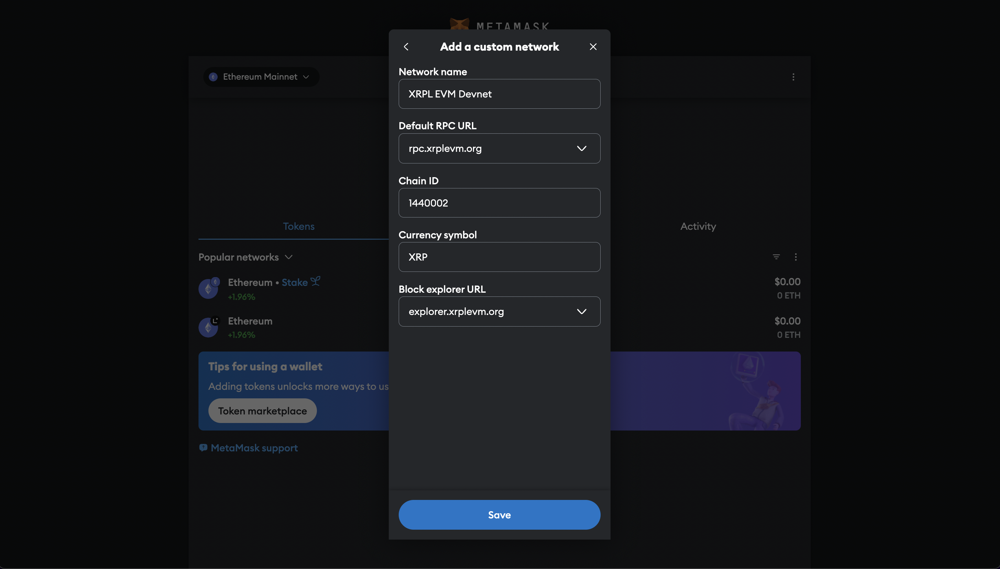
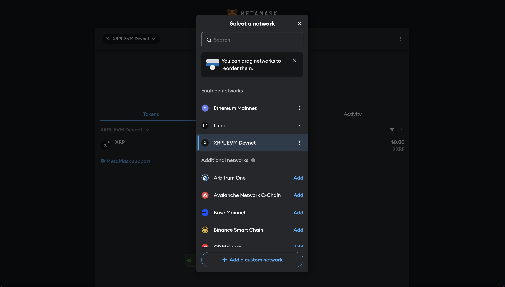

# Connect MetaMask to the XRPL EVM

## Attention

The XRPL EVM-compatible sidechain implementation is a **proof of concept** extension to the XRP Ledger protocol and is intended for development purposes only. It is currently connected to the **XRPL Devnet** and not the production mainnet. **Do not send transactions in Mainnet.**

This guide will walk you through configuring MetaMask to connect to the XRPL EVM.

---

## 1. Adding XRPL EVM to MetaMask

To interact with the XRPL EVM, you need to manually add it as a custom network in MetaMask.

1. **Open MetaMask**:
   - Click the MetaMask icon in your browser to open the wallet.

2. **Access Network Settings**:
   - In the MetaMask interface, click the network dropdown at the top (default is "Ethereum Mainnet").
   - Select **"Add Network."**

   

3. **Enter Network Details**:
   - Fill in the following information:
     - **Network Name:** XRPL EVM Devnet
     - **New RPC URL:** [http://rpc.xrplevm.org/](http://rpc.xrplevm.org/)
     - **Chain ID:** 1440002
     - **Currency Symbol:** XRP
     - **Block Explorer URL:** [https://explorer.xrplevm.org](https://explorer.xrplevm.org)

   

4. **Save Network**:
   - Click **"Save."** The XRPL EVM will now be available in the network dropdown.

5. **Switch Networks**:
   - Select "XRPL EVM Devnet" from the network dropdown to start interacting with the network.

   

---

## 2. Verifying the Connection

To ensure that MetaMask is properly connected to the XRPL EVM:

1. Open MetaMask and confirm that "XRPL EVM Devnet" is displayed as the active network.
2. Click **"Account Details"** to view your wallet address.
3. Verify that the balance and token details appear correctly (if you have already received test tokens).

---

## Notes for Testing and Development

- **Devnet Environment Only:**
  The XRPL EVM Sidechain is still in its Devnet phase. Use it exclusively for testing and development purposes.

- **Future Updates:**
  The Testnet launch is planned for the second half of January, which will offer a more stable environment for broader testing.

- **Transaction Fees:**
  Current transaction fees are around 4¢, but future adjustments aim to reduce this to approximately 1¢.

If you encounter any issues, ensure that the RPC URL, Chain ID, and other network details are entered correctly. For further assistance, refer to the XRPL EVM documentation or support channels.
