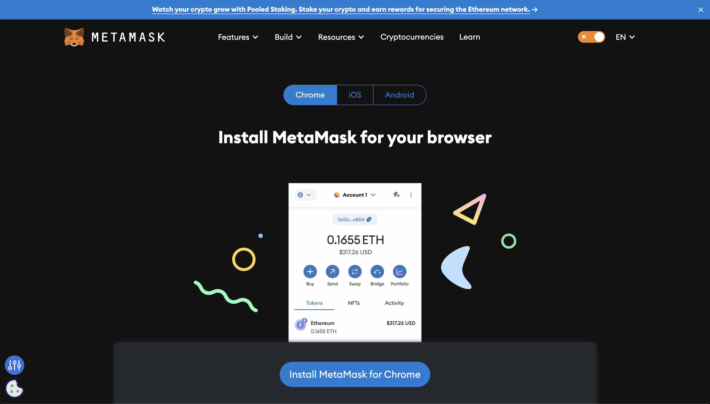
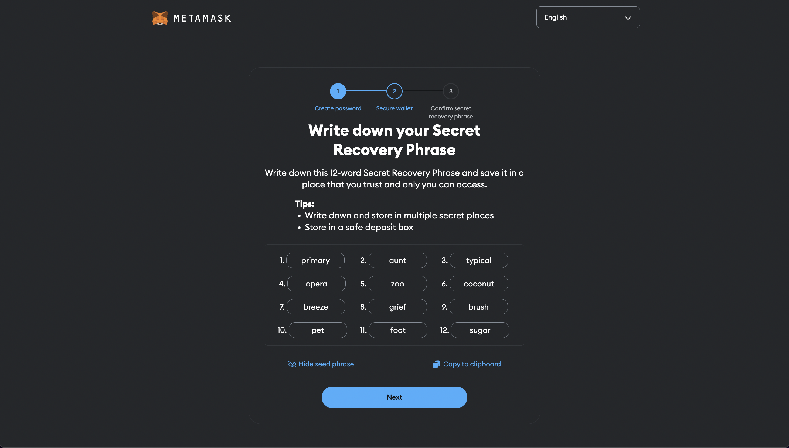
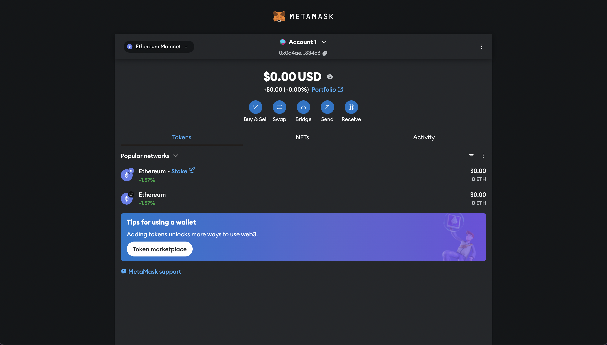
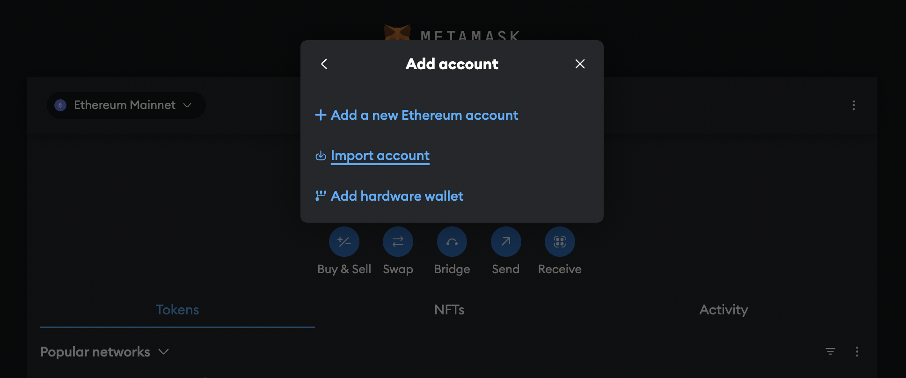

# Install MetaMask

This guide explains how to install MetaMask. For configuring it for XRPL EVM, refer to the [Connect MetaMask to the XRPL EVM Sidechain](../getting-started/connect-to-the-xrpl-evm.md) guide.

---

## Install MetaMask

To begin, download and install the MetaMask extension for your browser:

1. Visit [metamask.io](https://metamask.io/download/).
2. Select your preferred browser (Chrome, Firefox, Brave, or Edge) and follow the installation instructions.

Once installed, a MetaMask icon will appear in your browser's toolbar.

---

## Create an Account on MetaMask

Follow these steps to create a new MetaMask wallet:

1. Click the MetaMask icon in your browser.
2. Click **"Create a Wallet."**
3. Set a password and click **"Create."**
4. Secure your wallet:
   - Save the **seed phrase** provided by MetaMask in a safe location. This is the only way to recover your wallet if you lose access to it.
   - **Never share your seed phrase with anyone.**
   

Your MetaMask wallet is now ready to use.

---

## Import an Existing Account (Optional)

If you already have an XRPL EVM-compatible account, you can import it into MetaMask using its private key:

1. Open MetaMask and click the account icon in the top-right corner.
2. Select **"Import Account."**
3. Enter your private key and click **"Import."**

Your existing account will now be accessible in MetaMask.

---

## What's Next?

Now that you’ve successfully installed and set up MetaMask, you’re ready to connect it to the **XRPL EVM**. This will allow you to interact with the network, deploy smart contracts, and manage assets.

### Continue to the Next Guide:
- **[Connect MetaMask to the XRPL EVM Sidechain](../getting-started/connect-to-the-xrpl-evm.md)**: Learn how to configure MetaMask to connect to the XRPL EVM and start using its features.

### Additional Resources:
- **MetaMask Security Tips**:
  - Always back up your seed phrase in a secure location.
  - Be cautious when interacting with unknown websites or dApps.
  - Regularly check your connected sites in MetaMask and revoke access when not in use.

By following these steps, you’re now equipped with the tools to start your journey with the XRPL EVM. Let’s move forward and unlock the full potential of this innovative blockchain ecosystem!