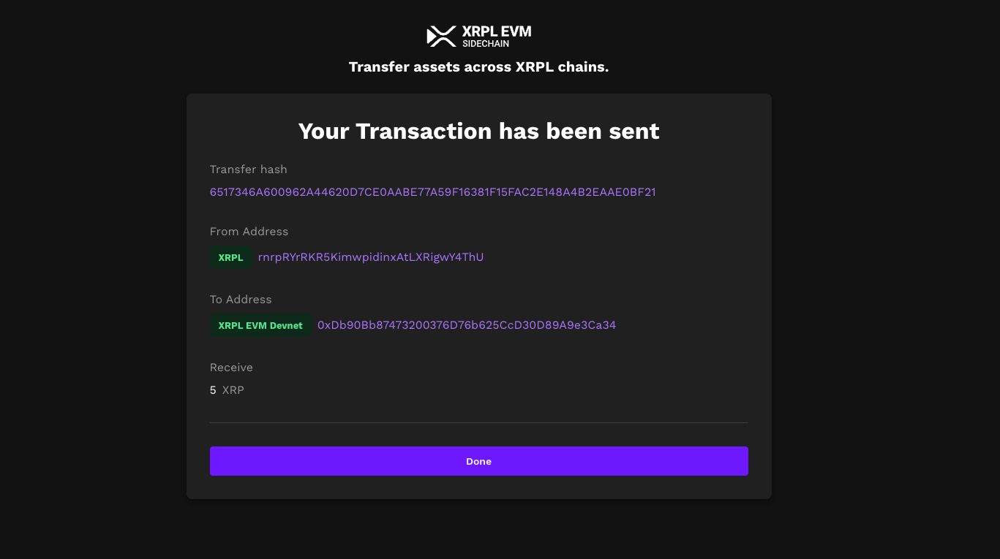

# Using the Bridge

The XRPL EVM bridge plays a critical role in facilitating asset and data transfers between the XRP Ledger (XRPL) and the XRPL Ethereum Virtual Machine (EVM) Sidechain. Initially designed to use the **XLS38d amendment**, Ripple and Peersyst later opted for the **Axelar bridge** due to its advanced capabilities. While the Axelar-powered bridge is still under development and lacks a fully functioning relayer, the older XLS38d-based bridge remains operational on the XRPL Devnet, though it will eventually be deprecated.

---

## XLS38d Bridge

The XLS38d bridge was developed as part of the proof-of-concept for the XRPL EVM sidechain. Although it is still functional on the Devnet, it will not be integrated into the XRPL Mainnet as the XLS38d amendment is not slated for approval.

### Attention

- The XRPL EVM compatible sidechain implementation is a **proof of concept** extension to the XRPL protocol and is **for development purposes only**.
- The bridge operates only on the XRP Ledger Devnet.
- **Do not send transactions in the XRPL Mainnet.**

### Steps to Use the XLS38d Bridge

#### 1. Create an Account Using an EVM-Compatible Wallet

To interact with the network, you need an XRPL EVM sidechain account. Use an EVM-compatible wallet like MetaMask to manage your account.

For instructions on how to install and create an account using MetaMask, see [Connect MetaMask to XRPL EVM Sidechain](./getting-started/connect-to-the-xrpl-evm.md).

#### 2. Submit a Transaction Using the EVM Sidechain Bridge

Once your account is set up, follow these steps to transfer tokens from the XRP Ledger Devnet to the XRPL EVM Sidechain:

1. **Select the Networks:**
   - Open the XRPL EVM Sidechain Bridge.
   - Select **XRPL Devnet** as the source network and **XRPL EVM Sidechain Devnet** as the destination network.
   

2. **Connect Both Wallets:**
   - **XRPL Wallet:** Use the faucet to generate a new XRPL Devnet wallet and connect it to the bridge.
   - **MetaMask Wallet:** Connect your MetaMask wallet to the XRPL EVM Sidechain bridge.
   

3. **Select a Token:**
   - Choose the token to transfer (e.g., XRP).
   

4. **Start the Transaction:**
   - Enter the amount of XRP to transfer.
   - Sign the transactions in MetaMask and the faucet wallet (automatically handled by the bridge client).
   
   - Wait for the transaction to process (up to a few minutes).
   

5. **Receive the Funds:**
   - Verify the transaction details, including hashes, addresses, and amounts, on the confirmation screen.
   

---

## Axelar Bridge

The Axelar-powered bridge represents the future of XRPL EVM interoperability. It uses Axelar's decentralized cross-chain communication protocol to provide a more robust and scalable solution for bridging assets and messages between the XRPL and XRPL EVM Sidechain.

### Attention

The Axelar bridge is currently under development and is not fully functional due to the absence of a relayer. All information is subject to change as development progresses.

### Steps to Use the Axelar Bridge (When Available)

#### Axelar Interchain Transfer from XRPL

1. **Set XRPL as the Source Chain:**
   - Open the Axelar Portal.
   - Set **XRPL** as the source chain and **XRPL EVM Sidechain** as the destination chain.
   

2. **Select the Faucet Account:**
   - Use the faucet to select an account on the XRPL chain.
   

3. **Connect Wallets:**
   - Connect your wallet (e.g., MetaMask) for the XRPL EVM Sidechain.
   

4. **Choose a Token and Amount:**
   - Select the token (e.g., XRP) and enter the amount to transfer.
   

5. **Transfer and Confirm:**
   - Click **Transfer** and confirm the transaction in your wallet.
   - View transaction details in the [Axelar Portal](https://axelarscan.io/).
   
   - Once the transaction is executed, you can see the transaction details in the following modal.
   
   

6. **Verify the Transaction:**
   - Use the [XRPL EVM Explorer](https://explorer.xrplevm.org) to confirm the transaction hash and ensure the transfer was successful.
   

---

## Key Differences Between XLS38d and Axelar Bridges

| Feature                  | XLS38d Bridge                     | Axelar Bridge                |
|--------------------------|------------------------------------|------------------------------|
| **Status**               | Functional on Devnet              | In Development               |
| **Future Integration**   | Will be deprecated                | Planned for full integration |
| **Cross-Chain Protocol** | Proprietary (XLS38d amendment)    | Axelar ITS                   |
| **Relayer**              | Not required                      | Required (not yet available) |
| **Scalability**          | Limited                           | High                         |

---

The transition to the Axelar bridge underscores the commitment to improving interoperability and scalability for XRPL EVM. While the XLS38d bridge remains a functional tool for testing, developers and users can look forward to the enhanced capabilities of the Axelar-powered bridge upon its completion.
